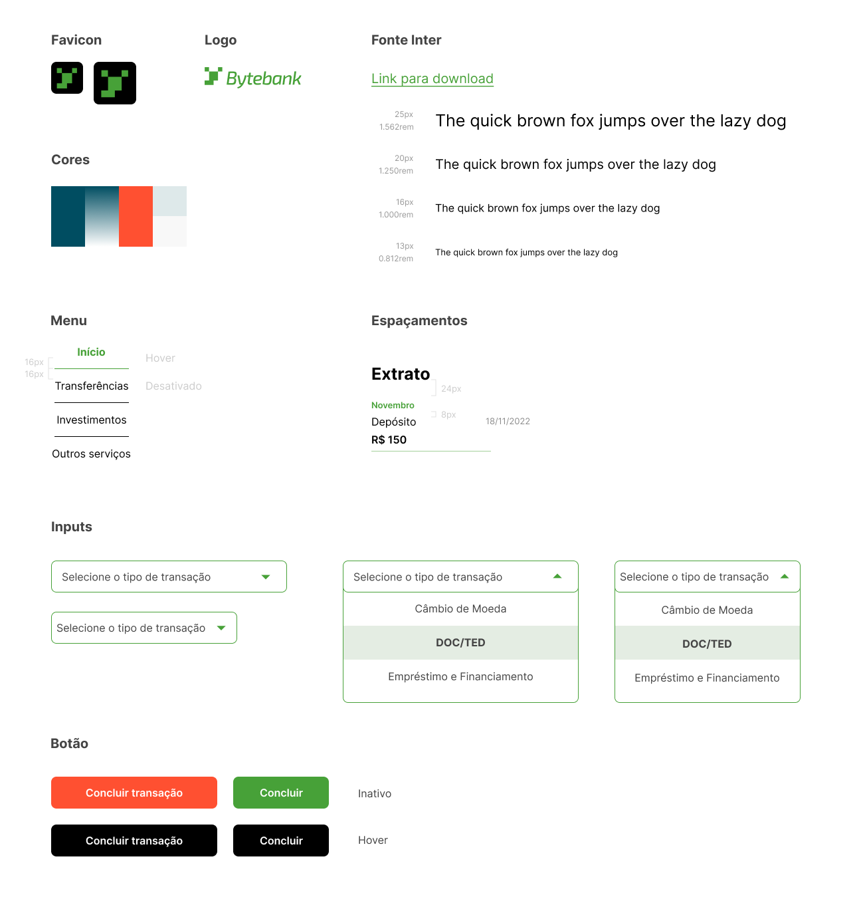
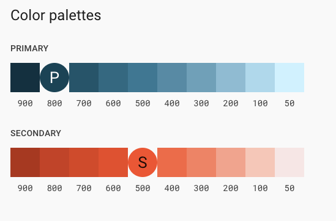

# FIAP Tech Challenge - Fase 3

Projeto desenvolvido em grupo para o terceiro tech challenge da FIAP.

## Resumo

Trata-se de uma plataforma mobile fictícia para a empresa financeira "Bytebank".
O protótipo das telas desenvolvidas pode ser encontrado no [Figma](https://www.figma.com/design/ns5TC3X5Xr8V7I3LYKg9KA/Projeto-Financeiro?node-id=503-4264&t=nhWQMyJ7ZmXNWbb6-1).

## Arquitetura do projeto

### Styleguide

Para o desenvolvimento do projeto nós seguimos o style guide proposto, porém com adaptações para seguir o [Material Design](https://m3.material.io/) e outras práticas que o grupo achou pertinente mudar.

### Demo

Video de demonstração do projeto no [Youtube](https://www.youtube.com/watch?v=aaCHz7Z5JqI).

## Rodando o projeto

**Requisitos**

1. Tenha certeza que está usando a versão LTS do [Node.js (20.x)](https://nodejs.org/en)

   a. Recomendamos o uso do [nvm](https://github.com/nvm-sh/nvm)

   b. Caso esteja usando o nvm, antes de instalar as deps rode `nvm use` e se necessário `nvm install` e depois `nvm use` novamente.

Para instalar as deps quando já estiver utilizando a versão LTS do Node, rode `npm i` ou `npm install`.

2. Tenha instalado localmente o SDK de Android e o emulador de um dispositivo configurado.

   a. O [Android Studio](https://developer.android.com/studio) pode ser utilizado para ambas as funções.

   b. Caso não queira utilizar um emulador, também é possível configurar uma ferramenta como [scrcpy](https://github.com/Genymobile/scrcpy) para utilizar seu próprio dispositivo como emulador.

### Ambiente de desenvolvimento local

Para executar o Expo rode:
`npm start`

## Tecnologias utilizadas

- [Expo](https://expo.dev/): Plataforma para desenvolvimento prático de apllicações em React Native.
- [React Native Paper](https://callstack.github.io/react-native-paper/): Material UI lib para componentes e ícones React Native.
- [React Native Chart Kit](https://github.com/indiespirit/react-native-chart-kit): Material UI lib para gráficos React Native.
- [Firebase](https://firebase.google.com): Plataforma cloud para desenvolvimento de aplicações, com base de dados, autenticação e outras funcionalidades podendo ser aplicadas.

## Conceitos aplicados

- Context API para gerenciamento de estado compartilhado;
- Paginação para carregar grandes volumes de dados;
- Atomic design para criação de componentes reutilizáveis.
